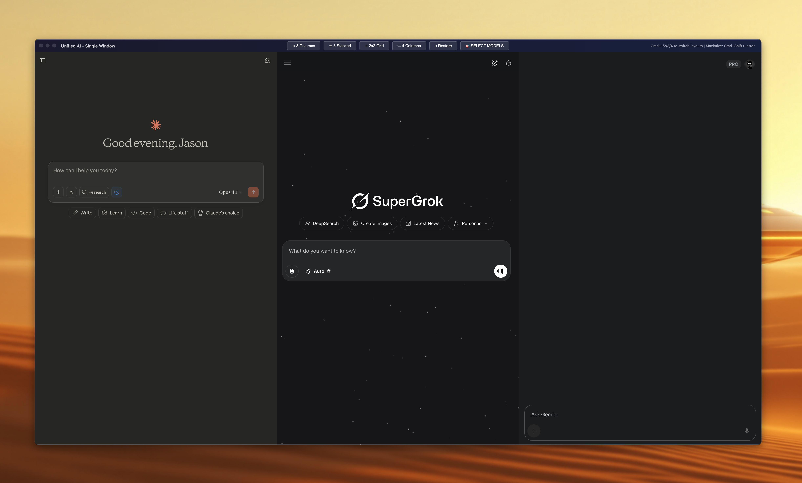
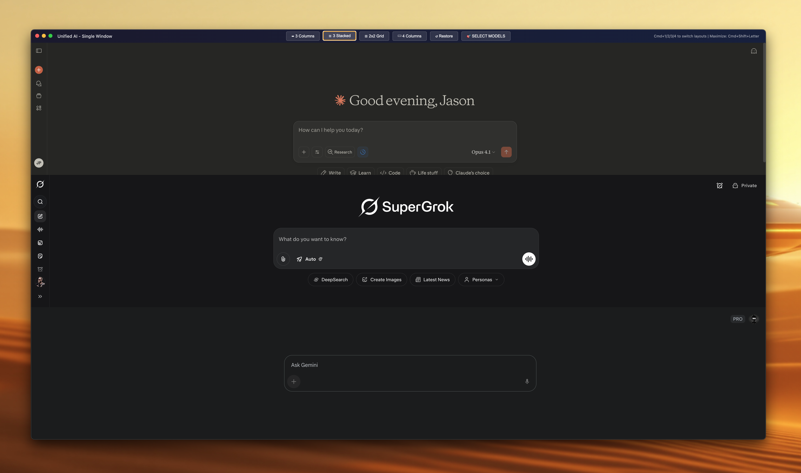
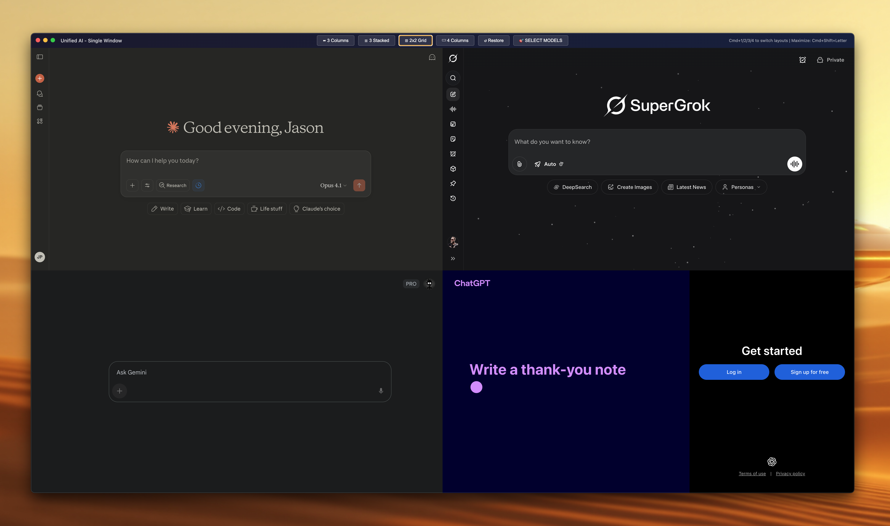
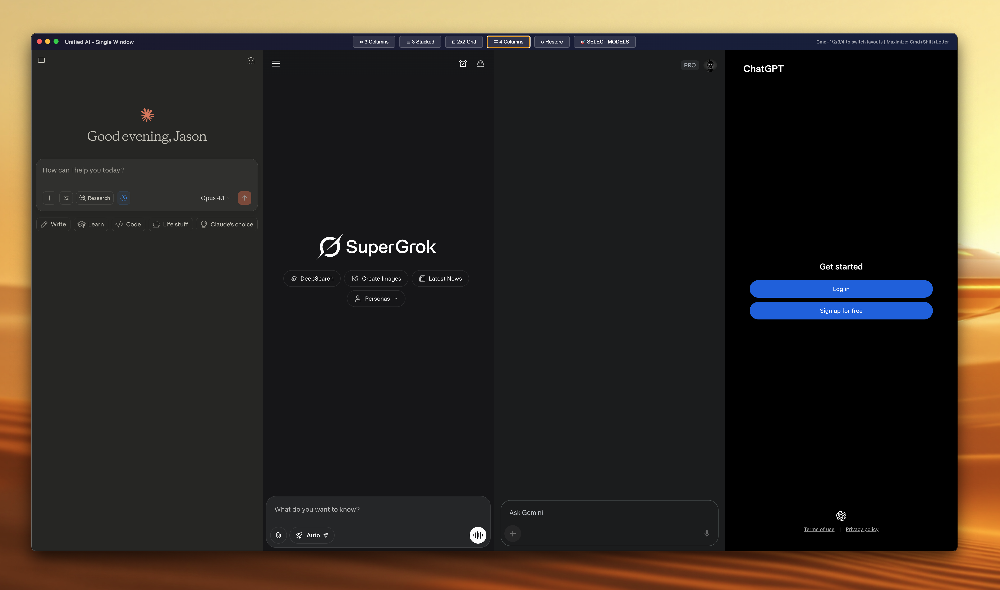
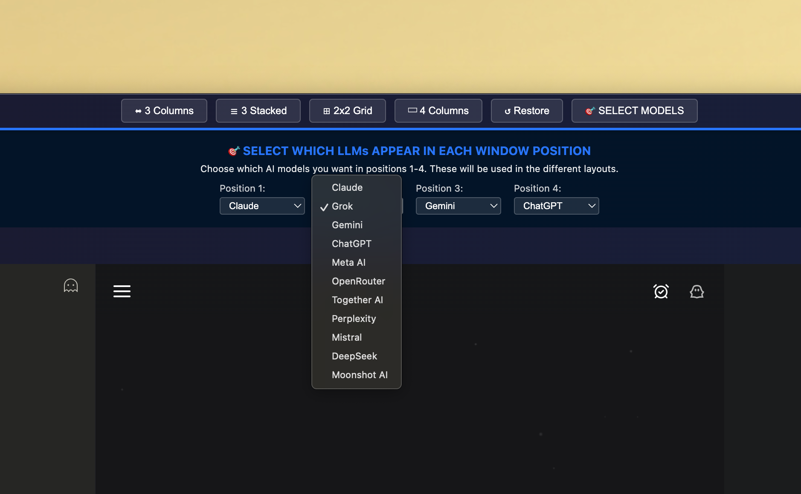

# Unified AI Hub 🤖

> Universal AI Assistant Interface - Access Claude, Grok, Gemini, and ChatGPT in one powerful window


[](https://opensource.org/licenses/MIT)
[](https://www.electronjs.org/)
[](https://nodejs.org/)
[](https://github.com/sanchez314c/unified-ai-hub/releases)

## 📸 Main Interface



> The Ultimate AI Assistant Hub - Switch Between Multiple AI Assistants Instantly

Unified AI Hub is a powerful desktop application that brings together multiple AI assistants in a single, unified interface. Built with Electron, it provides a seamless dark UI for accessing Claude, Grok, Gemini, and ChatGPT simultaneously, allowing you to compare responses, switch between services instantly, and manage multiple AI conversations efficiently.

## ✨ Features

- 🤖 **Multi-AI Support** - Access Claude, Grok, Gemini, and ChatGPT simultaneously
- 📐 **Flexible Layouts** - Horizontal split, vertical stack, grid view, and focus mode
- 🔄 **Hot-Switching** - Instantly switch between AI assistants without reloading
- 🎨 **Beautiful Dark UI** - Modern, professional interface optimized for extended use
- ⌨️ **Keyboard Shortcuts** - Full keyboard navigation and quick layout switching
- 💾 **Persistent Sessions** - Maintains separate sessions for each AI assistant
- 🖥️ **Cross-Platform** - Works seamlessly on macOS, Windows, and Linux
- 🔒 **Secure Architecture** - Isolated BrowserViews with enhanced security
- 📋 **Smart Copy/Paste** - Enhanced clipboard management with force paste
- 🌐 **Independent Sessions** - Each AI maintains its own context and cookies
- 🎯 **Focus Mode** - Dedicate full screen to one AI while keeping others accessible

## 🚀 Quick Start - One-Command Build & Run

### Option 1: One-Command Solution (Recommended)

```bash
# Clone and build
git clone https://github.com/sanchez314c/unified-ai-hub.git
cd unified-ai-hub

# Build and run with a single command!
npm run build
npm start
```

### Option 2: Development Mode

```bash
# Run in development mode with hot reload
npm run dev
```

### Build Options

```bash
# Build only (don't launch)
npm run build

# Build for specific platform
npm run build:mac        # Build for macOS
npm run build:win        # Build for Windows
npm run build:linux      # Build for Linux

# Build for all platforms
npm run build:all
```

## 📸 Layout Showcase


*Multiple AI assistants displayed simultaneously in flexible layouts*

## 📋 Prerequisites

For running from source:
- **Node.js** 14+ and npm
- **Git** (for cloning the repository)

The application includes all necessary dependencies for basic functionality.

## 🛠️ Installation

### Detailed Installation

```bash
# Clone the repository
git clone https://github.com/sanchez314c/unified-ai-hub.git
cd unified-ai-hub

# Install dependencies
npm install

# Start the application
npm start

# Or run in development mode
npm run dev
```

### Building from Source

```bash
# One-command build for current platform
npm run build

# Build for all platforms
npm run build:all

# Build for specific platforms
npm run build:mac
npm run build:win
npm run build:linux
```

### Build Output Locations

After building, find your executables in:
- **macOS**: `dist/Unified AI Hub-*.dmg` and `dist/mac*/Unified AI Hub.app`
- **Windows**: `dist/Unified AI Hub Setup *.exe`
- **Linux**: `dist/Unified AI Hub-*.AppImage` and `dist/*.deb`

## 📖 Usage

### 1. Starting the Application

- **Pre-built Binary**: Just double-click the application
- **From Source**: Run `npm start` or `npm run dev`

### 2. AI Assistant Access

The app provides access to multiple AI assistants:
- **Claude**: Anthropic's advanced conversational AI
- **Grok**: xAI's real-time knowledge assistant
- **Gemini**: Google's multimodal AI assistant
- **ChatGPT**: OpenAI's versatile conversational model

Navigate to any AI assistant and start your conversation immediately.

### 3. Layout Management

## 📸 Layout Configuration


*Flexible layout options for different workflows and preferences*

**Layout options:**
- **Horizontal Layout**: Three AI assistants side-by-side
- **Vertical Layout**: Three AI assistants stacked vertically
- **Grid Layout**: Four AI assistants in a 2x2 grid
- **Focus Mode**: One AI takes primary view with others minimized

### 4. Session Management

**Session features:**
- **Independent Sessions**: Each AI maintains separate context
- **Persistent Storage**: Conversations are saved per AI
- **Quick Switching**: Instant context switching between AIs
- **Isolated Cookies**: Each AI has its own cookie storage

## 🔧 Configuration

### Directory Structure

```
~/Library/Application Support/Unified AI Hub/    # macOS
%APPDATA%/Unified AI Hub/                        # Windows
~/.config/Unified AI Hub/                        # Linux
├── sessions/                    # AI session data
├── preferences.json            # User settings
├── layouts/                     # Custom layouts
└── logs/                       # Application logs
```

### Environment Variables

```bash
# Set custom configuration directory
export UNIFIED_AI_HUB_CONFIG_DIR=/path/to/config

# Enable debug mode
export UNIFIED_AI_HUB_DEBUG=1

# Set custom user agent
export UNIFIED_AI_HUB_USER_AGENT="Custom-Agent/1.0"
```

### Keyboard Shortcuts

| Shortcut | Action |
|----------|--------|
| `Cmd/Ctrl + 1` | Horizontal layout |
| `Cmd/Ctrl + 2` | Vertical layout |
| `Cmd/Ctrl + 3` | Grid layout (4 AIs) |
| `Cmd/Ctrl + 4` | Focus Claude |
| `Cmd/Ctrl + 5` | Focus Grok |
| `Cmd/Ctrl + 6` | Focus Gemini |
| `Cmd/Ctrl + 7` | Focus ChatGPT |
| `Cmd/Ctrl + R` | Reload all views |
| `Cmd/Ctrl + Shift + V` | Force paste |
| `F11` | Toggle fullscreen |

## 📸 Settings & Preferences


*Comprehensive settings panel for customization and AI preferences*

## 🐛 Troubleshooting

### Common Issues

<details>
<summary>AI assistants not loading</summary>

- **Network Connection**: Check internet connectivity
- **Authentication**: Verify you're logged into each AI service
- **Browser Profiles**: Clear individual AI browser data
- **Firewall**: Ensure HTTPS (port 443) is open
- **Service Status**: Check if AI services are operational
</details>

<details>
<summary>Performance issues</summary>

- **Memory Usage**: Close unused AI tabs or restart application
- **GPU Acceleration**: Enable hardware acceleration in settings
- **Session Cleanup**: Clear session data for problematic AIs
- **Background Processes**: Close other resource-intensive applications
</details>

<details>
<summary>Copypaste not working</summary>

- **Clipboard Access**: Ensure app has clipboard permissions
- **Force Paste**: Use `Cmd/Ctrl + Shift + V` for force paste
- **Browser Security**: Some sites block clipboard access
- **Context Menu**: Right-click for copy/paste options
</details>

<details>
<summary>Application crashes</summary>

1. Check system logs for error details
2. Update to latest Electron version
3. Clear application cache
4. Reset to default settings
5. Restart application
</details>

## 📁 Project Structure

```
unified-ai-hub/
├── src/                      # Source code
│   ├── main/                # Electron main process
│   │   ├── index.js         # Main entry point
│   │   ├── menu.js          # Application menu
│   │   └── windows/         # Window management
│   ├── renderer/            # Renderer process
│   │   ├── components/      # UI components
│   │   ├── styles/          # CSS and themes
│   │   └── index.html       # Main HTML
│   ├── preload/             # Preload scripts
│   └── shared/              # Shared utilities
├── build_resources/         # Build resources
│   ├── icons/              # Application icons
│   └── screenshots/        # App screenshots
├── scripts/                # Build and utility scripts
├── docs/                   # Documentation
├── tests/                  # Test files
├── dist/                   # Build outputs
└── archive/                # Archived files
```

## 🧪 Testing

```bash
# Run all tests
npm test

# Run tests in watch mode
npm run test:watch

# Run tests with coverage
npm run test:coverage
```

## 📦 Build Configuration

The application uses standard Electron build configuration:

### Build Settings
- **Electron Version**: 27.3+
- **Node.js Target**: 14+
- **Platforms**: macOS, Windows, Linux
- **Compression**: Maximum compression for smaller downloads

### Supported Platforms
- **macOS**: 10.15+ (Catalina and later)
- **Windows**: Windows 10+ (x64)
- **Linux**: Ubuntu 18.04+, Debian 10+, Fedora 32+

## 🔧 Scripts

| Script | Description |
|--------|-------------|
| `npm start` | Start application in production mode |
| `npm run dev` | Development mode with hot reload |
| `npm run build` | Build application for production |
| `npm run build:all` | Build for all platforms |
| `npm run test` | Run test suite |
| `npm run lint` | Run ESLint |

## 🎨 Design

### UI Components

- **AI Viewport**: Individual browser views for each AI assistant
- **Layout Manager**: Dynamic layout switching and resizing
- **Control Panel**: Quick access to settings and layout controls
- **Session Manager**: Independent session management per AI
- **Context Menu**: Enhanced clipboard and navigation options

### Design Principles

- **Unified Experience**: Consistent interface across all AI services
- **Dark Theme**: Easy on the eyes during extended AI interactions
- **Responsive**: Adapts to different screen sizes and resolutions
- **Keyboard Accessible**: Full keyboard navigation support
- **Performance First**: Optimized for smooth AI assistant interactions

## 🔒 Security

### Security Features

- **Isolated BrowserViews**: Each AI runs in separate isolated context
- **Context Isolation**: Enabled for enhanced security
- **Web Security**: Enforced for all renderer processes
- **No Node Integration**: Disabled in renderers for security
- **Session Isolation**: Independent sessions prevent cross-contamination
- **Persistent Partitions**: Each AI maintains its own data partition

### Privacy Protection

- **Local Storage**: All session data stored locally
- **No Data Collection**: Application doesn't collect user data
- **Encrypted Storage**: Sensitive data encrypted when possible
- **User Control**: Full control over session data and cookies

## 📸 Security Architecture


*Isolated BrowserViews ensure secure, independent AI sessions*

## 🤝 Contributing

Contributions are welcome! Please feel free to submit pull requests or create issues for bug reports and feature requests.

### Development Setup

```bash
# Clone the repo
git clone https://github.com/sanchez314c/unified-ai-hub.git
cd unified-ai-hub

# Install dependencies
npm install

# Run in development mode
npm run dev

# Run tests
npm test

# Lint code
npm run lint
```

### Code Style

- **JavaScript**: Use modern ES6+ syntax
- **Electron**: Follow Electron security best practices
- **HTML5**: Semantic HTML5 structure
- **CSS3**: Modern CSS with proper organization

## 📄 License

This project is licensed under the MIT License - see the [LICENSE](LICENSE) file for details.

## 🙏 Acknowledgments

- **Electron** - For making cross-platform development possible
- **AI Service Providers** - Anthropic (Claude), xAI (Grok), Google (Gemini), OpenAI (ChatGPT)
- **Open Source Community** - For inspiration and feedback
- **Security Researchers** - For security best practices and guidance

## 🔗 Links

- [Report Issues](https://github.com/sanchez314c/unified-ai-hub/issues)
- [Request Features](https://github.com/sanchez314c/unified-ai-hub/issues/new?labels=enhancement)
- [Discussions](https://github.com/sanchez314c/unified-ai-hub/discussions)
- [Releases](https://github.com/sanchez314c/unified-ai-hub/releases)

---

**Unified AI Hub v1.0** - Universal AI Assistant Interface
Made with AI!